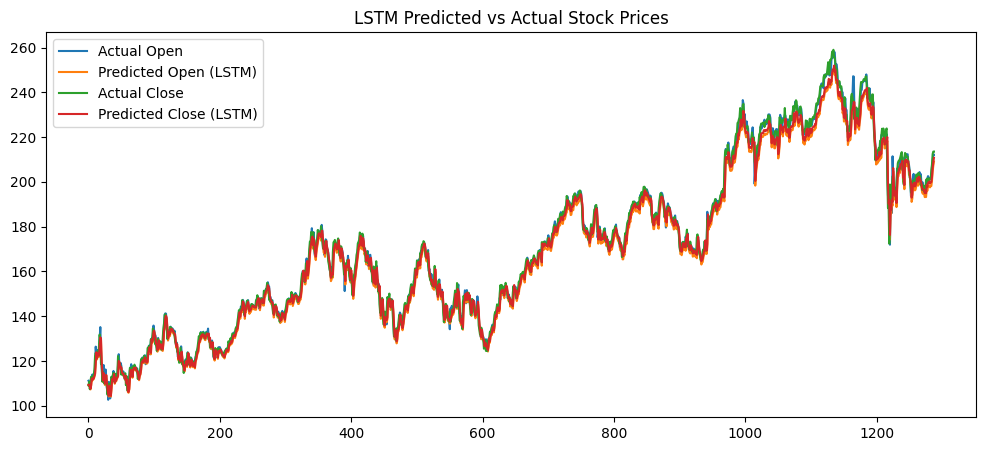

# 📈 Stock Price Prediction with LSTM & GRU (PyTorch)

This project implements and compares two deep learning models — LSTM and GRU — to predict **Open** and **Close** stock prices using historical data. The models are built using **PyTorch** and trained on a time series dataset, leveraging the past 30 days' features to predict the next day's prices.

---

## 🧠 Models Used

- **LSTM (Long Short-Term Memory)**: Captures long-term dependencies in time series data.
- **GRU (Gated Recurrent Unit)**: A lighter alternative to LSTM with fewer parameters.

---

## 🔧 Features

- Data preprocessing using `pandas`, `numpy`, and `scikit-learn`
- Sequence windowing for time-series forecasting (past 30 days)
- Model training using PyTorch
- Performance comparison using **MSE (Mean Squared Error)**
- Visualization of actual vs predicted stock prices
- Model saving for deployment
- Ready for integration with Streamlit or Flask for deployment

---

## 📊 Results

| Model | MSE (Open Price) | MSE (Close Price) |
|-------|------------------|-------------------|
| LSTM  | 10.7422          | 16.8829           |
| GRU   | 62.9326          | 50.9872           |

✅ **LSTM** outperformed GRU in both Open and Close price predictions.

---

## 🗂 Project Structure

```

.
.
├── data/
│   └── stock_data.csv
├── models/
│   └── lstm_model_weights.pth
├── notebooks/
│   └── stock_prediction.ipynb
├── scaler/
│   └── scaler.save
├── lstm_model.py
├── gru_model.py
├── train.py
├── evaluate.py
├── predictions/             <-- CSV exported from Python predictions
│   └── predicted_stock.csv
└── cpp_inference/
    └── fast_inference.cpp
````

---

## 🚀 How to Run

### 1. Clone the Repository

```bash
git clone https://github.com/yourusername/stock-price-prediction-lstm-gru.git
cd stock-price-prediction-lstm-gru
````

### 2. Install Dependencies

```bash
pip install -r requirements.txt
```

### 3. Run the Training Script

```bash
python train.py
```

### 4. Evaluate the Model

```bash
python evaluate.py
```

---

## 🧪 Example Output

```
Actual Open: 111.20, Pred Open: 110.68 | Actual Close: 109.14, Pred Close: 111.37
Actual Open: 110.60, Pred Open: 110.17 | Actual Close: 110.73, Pred Close: 111.18
...
```



---

## 💾 Deployment

To deploy the model:

* Load `lstm_model_weights.pth` and `scaler.save`
* Use a framework like [Streamlit](https://streamlit.io/) or [Flask](https://flask.palletsprojects.com/) for a web interface
* Optionally package in a Docker container for cloud deployment

---

## 📚 Tech Stack

* Python 🐍
* PyTorch 🔥
* NumPy & Pandas
* scikit-learn
* Matplotlib & Seaborn

---

## 📃 License

This project is licensed under the MIT License.

```

---

Let me know if you want:
- A `requirements.txt`
- To auto-generate metrics or plots
- A deploy-ready Streamlit or Flask template

Would you like me to help set up the repo structure or deployment next?
```
